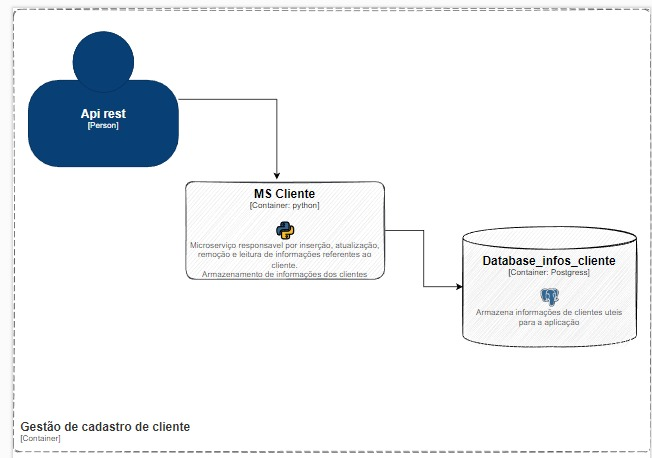

# Escopo
  Entregar uma api que permita realizar consultas, inserções, atualizações e excluções de informações de um usuário.

# Requisitos funcionais
## Inserção
Endpoint no qual pode-se inserir conteúdos no banco, através de uma chamada http post
## Remoção
Endpoint no qual pode-se remover conteúdos no banco, ataves de uma chamada http post
## Atualização 
Endpoint no qual pode-se atualizar conteúdos no banco, ataves de uma chamada http post
## Consulta 
Endpoint no qual pode-se consultar conteúdos no banco, ataves de uma chamada http get

# Requisitos não funcionais
## Latência
Latência é um requisito para que as requisições sejam atendidas e retornadas em um tempo habil
## Confiabilidade
As informações que estão armazenadas no banco devem permancer de forma consistente, sem nenhum tipo de alteração 
## Segurança
Apenas pessoas autorizadas podem fazer as alterações nas informações armazenadas no banco

## Tecnologias envolvidas
-Backend: Python+flask

-Banco de dados: Postgres

# Cenário da api atual
Atualmente a api conta com um container python que recebe requisições http e faz querys para uma base de dados e retorna o resultado para o requisitante

## Diagrama de container
   
   
